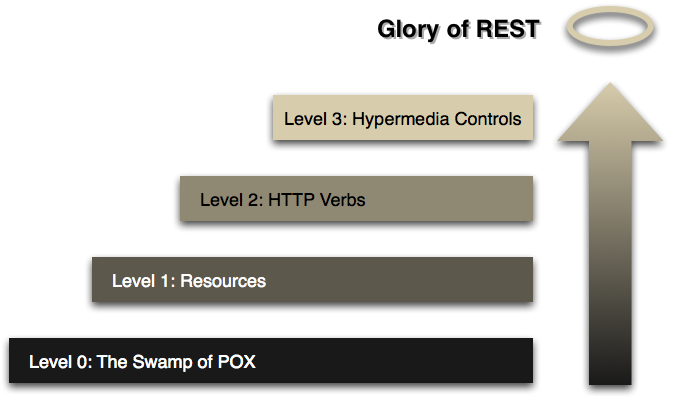

# Lunch and Learn HTMX

What is HTMX?

- It is a JS library specifically to reduce the amount of JS code you have to write.
- Completes HTML to enable a web application to use Hypermedia as the Engine of Application State (HATEOAS), a concept from REST.
  - This is done by letting the client observe events emmited by the page through things such as AJAX or CSS transitions to then serve out hypermedia.

Why did I choose to learn this library?
>IDK why did you use React? Because it looked like something cool to use!

- I wanted to learn more about web application architecture
- Javascipt is easy to write poorly and I felt like everything I wrote in the language was just wrong. (it probably was.)
- It enabled me to write a decoupled frontend that utilizes most of the logic on the backend and serve the frontend out as HTML.
- I found it on Youtube and the people that pushed it did a good enough job convicing me it was worth checking out.
- The usecase for the application I wanted to write fits  well into this library's primary purpose.

How can HTMX make your application more RESTful? What does RESTful mean anymore?

- Roy Fielding helped create Representational State Transfer (REST) and HTTP... below outlines Richardson Maturity Model (RMM) which is a framework for evaluating the maturity of web services in terms of their adherence to RESTful principles:



- The first level of REST architecture, also known as "The Swamp of POX (Plain Old XML)", involves using HTTP as a transport system for remote interactions, but without leveraging any of the system's built-in capabilities such as methods, status codes, or caching. It's essentially using HTTP as a tunnel for your own remote interaction design.

- The second level of REST architecture, known as "Resources", involves breaking down the service into distinct resources. Each resource is identified by a specific URI (Uniform Resource Identifier). This level introduces the concept of addressing and interacting with resources individually, which is a key aspect of the REST architectural style.

- The third level of REST architecture, known as "HTTP Verbs", involves using the standard HTTP methods like GET, POST, PUT, DELETE, etc. in a way that's consistent with their defined semantics. This level leverages the built-in capabilities of HTTP to perform CRUD (Create, Read, Update, Delete) operations, making the API more intuitive and aligned with the protocol's design.

- The fourth level of REST architecture, known as "Hypermedia Controls", involves including hypermedia within the response to guide the client to other resources. This level introduces the concept of HATEOAS (Hypermedia as the Engine of Application State), which means that the client interacts with the server entirely through hypermedia provided dynamically by application servers. This makes the API self-descriptive and allows the client to navigate the API dynamically, as opposed to hard-coding paths to resources.

--- 

Lets run this application!

```RUST_LOG=debug cargo run```
